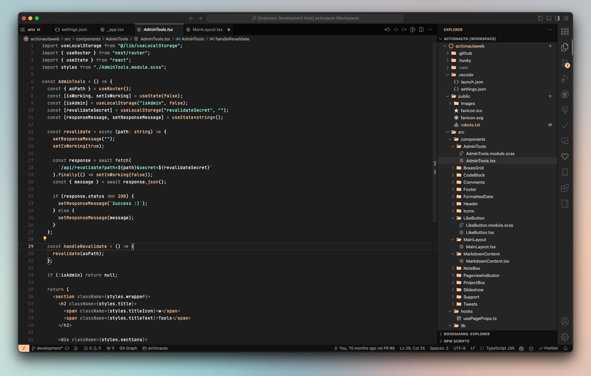
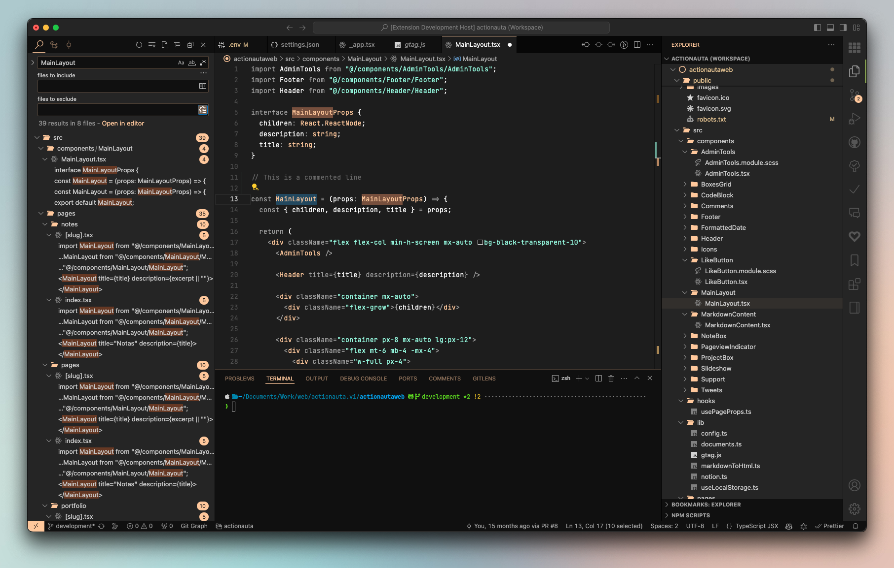

# Vizcacha Theme

### Screenshots

#### Main editor + Explorer



#### Main editor + Search and Terminal panels



### Description

_Vizcacha Theme_ is a dark Visual Studio Theme inspired on the fantastic [Vesper Theme](https://github.com/raunofreiberg/vesper) (by Rauno Freiberg),
) with some personal taste customizations.

This low-color theme privileges focus and readability, with a clean and minimalistic design.

The most important differences are:

- Some toned down colors
- Lighter background and panel colors

### More...

#### File icon theme used in the screenshots

The file icon theme used in the screenshots is [Material Icon Theme](https://marketplace.visualstudio.com/items?itemName=PKief.material-icon-theme) by Philipp Kief, with the following settings:

```json
{
  "material-icon-theme.hidesExplorerArrows": false,
  "material-icon-theme.folders.theme": "classic",
  "material-icon-theme.opacity": 1,
  "material-icon-theme.saturation": 0,
  "material-icon-theme.folders.color": "#ffc799",
  "material-icon-theme.activeIconPack": "react_redux"
}
```

#### What is a Vizcacha?

> The southern viscacha (Lagidium viscacia) is a species of viscacha, a rodent in the family Chinchillidae found in Argentina, Bolivia, Chile, and Peru. It is a colonial animal living in small groups in rocky mountain areas. It has long ears and hind legs and resembles a rabbit in appearance apart from its long, bushy tail, but is not a lagomorph.

Source: [Wikipedia](https://en.wikipedia.org/wiki/Southern_viscacha)
